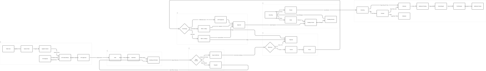
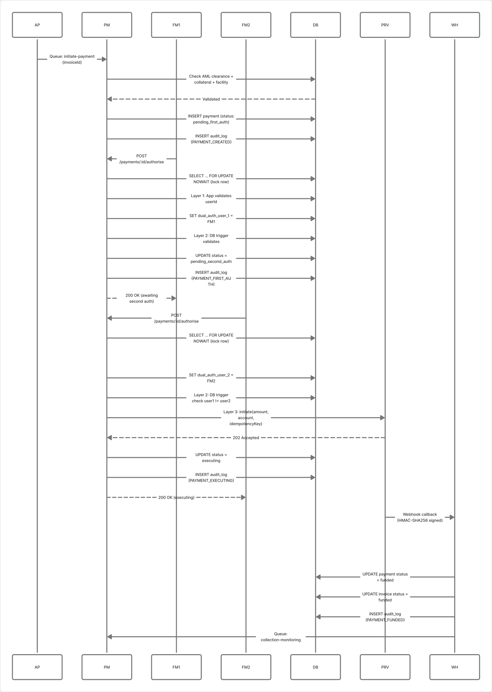
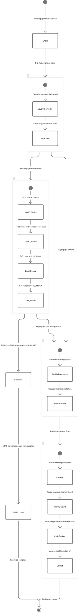
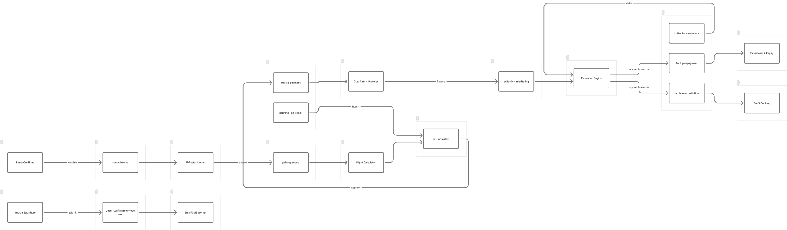

# RIS Platform - System Journey Map

> **Document ID:** JOURNEY-MAP-001
> **Version:** 1.0
> **Date:** 2026-04-02
> **Status:** Current

## Context

The RIS Platform is an invoice discounting system for Uganda. It purchases approved invoices from suppliers at a discount, pays suppliers within 72 hours, and collects from buyers at maturity. This journey map traces the complete lifecycle across 6 roles and 13 stages.

---

## Journey Map: End-to-End Invoice Lifecycle

### PHASE 1: ONBOARDING (Supplier Self-Service + Compliance Review)

```
STAGE 1: ELIGIBILITY & REGISTRATION
Actor: Supplier (public)
---------------------------------------------
[Public User]
  --> POST /eligibility/check
      Validates: registered company, authorized person, 1+ year in business
      Output: eligibility_session_token (24h valid)
  --> POST /suppliers/register (with token)
      Input: email, password, company details, directors, bank details, 3 consents
      PII encrypted (AES-256) before storage
      Sanctions screening (non-blocking flag)
      Output: userId + supplierId created, role='supplier'
      Notification: welcome email queued

STAGE 2: KYC DOCUMENT UPLOAD
Actor: Supplier --> Compliance Officer
---------------------------------------------
[Supplier]
  --> POST /suppliers/:id/documents (x4)
      Required: Certificate of Incorporation, Tax Registration, Director ID, Signed Agreement
      Max 10MB, PDF/JPEG/PNG only, SHA-256 hashed, encrypted on disk
      Auto-transition: all 4 uploaded --> kyc_status: 'under_review'

[Compliance Officer]
  --> PUT /admin/suppliers/:id/kyc-status
      Review docs --> approved OR rejected (with comments)
      URSB verification + litigation check recorded
      Notification: kyc_approved/kyc_rejected email to supplier

KYC Flow: pending --> under_review --> approved/rejected
```

### PHASE 2: INVOICE SUBMISSION & VERIFICATION

```
STAGE 3: INVOICE CREATION & SUBMISSION
Actor: Supplier
---------------------------------------------
[Supplier]
  --> POST /invoices (create draft)
      Input: invoice_number, buyer_id, face_value (BigInt), due_date, description
  --> POST /invoices/:id/submit
      5-Step Validation Chain (all logged even on failure):
        1. Supplier Active Check (kyc_status = approved)
        2. Duplicate Check (invoice_number unique per supplier)
        3. Buyer Relationship (buyer exists + linked to supplier)
        4. Tenor Validation (7-90 days)
        5. AML Check (face_value < 100M UGX threshold)
      On pass: status --> 'submitted', tenor calculated
      Queue: buyer-confirmation-request notification

STAGE 4: BUYER CONFIRMATION
Actor: Buyer (external, via email link)
---------------------------------------------
[Buyer]
  --> Receives email with 48-hour confirmation link (token: 64 hex chars, SHA-256 hashed in DB)
  --> GET /verify/:token (view confirmation page + RIS bank details + Notice of Assignment)
  --> POST /verify/:token/confirm
      Must affirm ALL 4: invoice valid, amount correct, due date correct, agrees to pay RIS
      On confirm: status --> 'buyer_confirmed', token invalidated
      Queue: score-invoice job
  --> OR POST /verify/:token/dispute
      Dispute recorded, credit_officer notified, invoice stays 'submitted'

  SLA: 48 hours. Reminders at T+2d, T+5d. Escalation at T+7d.
  Credit officer can resend: POST /admin/invoices/:id/resend-confirmation
```

### PHASE 3: RISK ASSESSMENT & PRICING (Automated)

```
STAGE 5: RISK SCORING
Actor: System (automated via BullMQ)
---------------------------------------------
[Risk Engine]
  Triggered by: score-invoice queue job after buyer confirmation
  5 Risk Factors (weights sum to 1.0):
    1. Buyer Credit (30%) - credit rating, payment score
    2. Supplier Track Record (25%) - historical performance, defaults
    3. Collateral Quality (20%) - coverage ratio, type
    4. Concentration Risk (15%) - buyer exposure %, hard cap 30%
    5. Tenor Risk (10%) - longer = riskier

  Decision Thresholds:
    composite >= 70 --> eligible for AUTO approval
    composite 50-69 --> manual review (TIER_2 or TIER_3)
    composite < 50  --> auto-reject --> status: 'rejected'

  Output: risk_assessment record, max_advance_pct, risk_premium_rate
  Status: buyer_confirmed --> 'scored' (or 'rejected')

STAGE 6: PRICING CALCULATION
Actor: System (automated)
---------------------------------------------
[Pricing Engine]
  Triggered by: scoring completion
  Rate Sources:
    bank_cost_rate     --> from active facility (interest_rate_annual)
    risk_premium_rate  --> from risk assessment
    mms_margin_rate    --> from buyer_mms_margins table
    max_advance_pct    --> from risk assessment

  Formula (BigInt, PRECISION = 1e8):
    Total Annual Rate = bank_cost + risk_premium + mms_margin
    Discount Rate = Total Annual Rate x (tenor_days / 365)
    Advance Amount = face_value x max_advance_pct
    Discount Amount = face_value x Discount Rate
    Net Payment = Advance Amount - Discount Amount
    RIS Profit = Discount Amount - Bank Cost Amount

  Output: pricing locked on invoice + risk_scores table
```

### PHASE 4: APPROVAL (3-Tier Matrix)

```
STAGE 7: APPROVAL ROUTING & DECISION
Actors: System (routing), Credit Officer, Management, Compliance Officer
---------------------------------------------
[System Routes to Tier]
  AUTO:   face_value < 10M UGX AND score >= 75 AND no AML flag
          --> System auto-approves, status --> 'approved'
  TIER_2: face_value 10M-50M UGX OR score 50-74 OR aml_flagged
          --> 1 credit_officer approval required
  TIER_3: face_value > 50M UGX OR score < 50
          --> 2 different officers required (quorum)

[Credit Officer / Management]
  --> POST /invoices/:id/approve (with comments)
      Concurrency: SELECT ... FOR UPDATE NOWAIT (prevents simultaneous reviews)
      TIER_3: 1st approval recorded, quorum=false; 2nd by DIFFERENT officer completes
      Dual auth enforced: user_1 != user_2
  --> POST /invoices/:id/reject (with comments, reason)
      status --> 'rejected', supplier notified

[Compliance Officer]
  --> AML Gate: if face_value >= 100M UGX, must clear aml_cleared_at before payment

  SLA: 24 hours from 'scored' to decision. Hourly breach check notifies management.
  Status: scored --> 'approved' or 'rejected'
```

### PHASE 5: PAYMENT DISBURSEMENT (Dual Authorisation)

```
STAGE 8: PAYMENT INITIATION
Actor: System
---------------------------------------------
[Payments Module]
  Triggered by: approval completion queue job
  Creates payment record: status = 'pending_first_auth'
  Checks: AML clearance, collateral coverage >= 50%, facility balance
  Idempotency: findByIdempotencyKey prevents double-disbursement
  Provider: EFT (bank ACH — mobile money was retired; supplier preference column is ignored)

STAGE 9: FIRST AUTHORISATION
Actor: Finance Manager #1
---------------------------------------------
[Finance Manager]
  --> POST /payments/:id/authorise
      Lock row: SELECT ... FOR UPDATE NOWAIT
      Records dual_auth_user_1 = userId
      Status: pending_first_auth --> 'pending_second_auth'
      Audit: PAYMENT_FIRST_AUTH

STAGE 10: SECOND AUTHORISATION & EXECUTION
Actor: Finance Manager #2 (MUST BE DIFFERENT)
---------------------------------------------
[Different Finance Manager]
  --> POST /payments/:id/authorise
      Dual-Auth Enforced at 3 Layers:
        Layer 1: App code (userId != dual_auth_user_1)
        Layer 2: DB trigger (prevents same user in both columns)
        Layer 3: Provider only called after DB confirms different users
      Calls provider API: initiate disbursement
      Status: pending_second_auth --> 'executing'

[Provider Webhook Callback]
  --> POST /payments/webhook/mtn or /airtel
      HMAC-SHA256 verified (timing-safe), replay prevented
      Success: status --> 'funded', invoice --> 'funded'
      Failure: status --> 'failed', retry 3x (30s/120s/480s)

  Target SLA: 72 hours from approval to funded
```

### PHASE 6: COLLECTION & RECOVERY

```
STAGE 11: COLLECTION MONITORING
Actor: System (scheduled jobs), Credit Officer
---------------------------------------------
[System - Scheduled Jobs]
  T-7 days: Payment reminder to buyer
  T-3 days: Second reminder
  T+0:      "Payment due today" notice
  T+1:      OVERDUE triggered if no payment
             status: funded --> 'collecting' --> 'overdue'
             Penalty begins: face_value x 0.1% x days_overdue (BigInt)

[4-Level Escalation Path]
  Level 0 (T+0):  Reminder SMS/email
  Level 1 (T+1):  First contact notice, status --> 'overdue'
  Level 2 (T+3):  Formal written notice, cc legal
  Level 3 (T+7):  Legal action initiated
                   IF face_value >= 100M UGX --> SAR_REVIEW_FLAGGED
                   Compliance officer files SAR with FIA Uganda

[Credit Officer]
  --> POST /collections/:id/payments (record buyer payment)
      Input: amount, payment_method, payment_date, payment_reference
      On payment: status --> 'collected'
      Queues: facility-repayment + settlement-initiation
  --> POST /collections/:id/escalate / de-escalate (manual override)

[Management]
  --> Marks defaulted if legal action fails (T+90d)
      Full recourse: RIS can claim face_value from supplier
      Status: overdue --> 'defaulted'
```

### PHASE 7: SETTLEMENT & PROFIT BOOKING

```
STAGE 12: SETTLEMENT
Actor: Finance Manager, Management
---------------------------------------------
[Finance Manager]
  --> POST /settlements/:invoiceId/initiate
      Creates settlement: status = 'pending'
      Links: invoice + collection + drawdown

  --> POST /settlements/:id/repay-facility
      Repays bank: principal + accrued_interest
      Status: pending --> 'facility_repaid'

  --> POST /settlements/:id/book-profit
      net_profit = discount_earned - bank_cost_paid + penalty_income
      Creates IMMUTABLE profit_bookings record (DB trigger prevents UPDATE/DELETE)
      Status: facility_repaid --> 'profit_booked'

[Management]
  --> POST /settlements/:id/close
      Final sign-off
      Status: profit_booked --> 'closed'
      Notification: settlement_complete to supplier

Settlement Flow: pending --> facility_repaid --> profit_booked --> closed
```

---

## Complete Status Machine

```
draft
  |--submit (5-step validation)--> submitted
                                      |--buyer confirms--> buyer_confirmed
                                      |--buyer disputes--> [stays submitted]

buyer_confirmed
  |--risk score >= 50--> scored
  |--risk score < 50---> rejected

scored
  |--AUTO/TIER approve--> approved
  |--officer rejects----> rejected

approved
  |--payment created--> pending_first_auth
                          |--1st finance_manager--> pending_second_auth
                                                      |--2nd finance_manager (different)--> executing
                                                                                             |--provider success--> funded
                                                                                             |--provider failure--> failed --> pending_first_auth (retry)

funded
  |--auto--> collecting
               |--buyer pays on time--> collected --> [settlement flow]
               |--T+1 no payment------> overdue
                                           |--buyer pays late--> collected --> [settlement flow]
                                           |--legal fails------> defaulted
```

---

## Role Responsibility Matrix

| Stage | Supplier | Buyer | Credit Officer | Finance Manager | Compliance Officer | Management | Auditor |
|-------|----------|-------|----------------|-----------------|-------------------|------------|---------|
| Registration | Self-register | - | - | - | - | - | - |
| KYC | Upload docs | - | - | - | Approve/Reject | - | - |
| Invoice Submit | Create & submit | - | View all | - | - | - | - |
| Verification | - | Confirm/Dispute | Resend token | - | - | - | - |
| Risk Scoring | - | - | - | - | - | - | - |
| Approval | - | - | Approve (T2/T3) | - | Clear AML | Override (T3) | - |
| Payment Auth | - | - | - | Dual auth (x2) | - | - | - |
| Collections | - | Pay | Record payment | Escalate | SAR review | Write-off | - |
| Settlement | - | - | - | Initiate/repay/book | - | Close | - |
| Reporting | View own | - | Aging, exposure | P&L, facility | Regulatory | All | Audit export |

---

## Queue-Driven Handoffs (BullMQ)

```
invoices.submit -----> [buyer-confirmation-request] -----> notifications (email to buyer)
verification.confirm -> [score-invoice] -----------------> risk-engine (auto-score)
risk-engine.score ----> [pricing-queue] -----------------> pricing (auto-price)
approvals.approve ----> [initiate-payment] --------------> payments (create payment record)
payments.funded ------> [collection-monitoring] ----------> collections (start tracking)
collections.payment --> [facility-repayment] -------------> facilities (repay drawdown)
collections.payment --> [settlement-initiation] ----------> settlements (start settlement)
[hourly] ------------> [approval-sla-check] --------------> approvals (breach alerts)
[daily] -------------> [collection-reminders] ------------> collections (buyer reminders)
[daily] -------------> [facility-interest-accrual] -------> facilities (accrue interest)
```

---

## Visual Diagrams

### 1. Invoice Lifecycle Journey Map
Complete 7-phase flowchart with all 13 stages, color-coded by phase.


### 2. Dual Auth Payment Flow
Sequence diagram showing 3-layer dual authorisation enforcement between Finance Managers, database triggers, and payment providers.


### 3. Collections Escalation State Diagram
State machine with 4-level escalation path, SAR triggers at 100M UGX, and settlement sub-flow.


### 4. Queue-Driven Module Handoffs
Flowchart showing BullMQ async connections between all 11 modules, including scheduled jobs.

